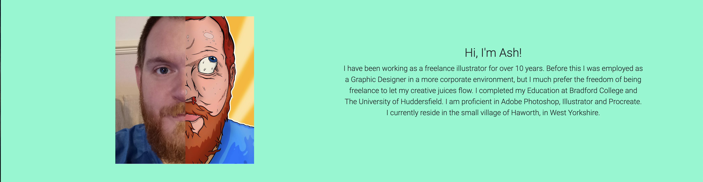
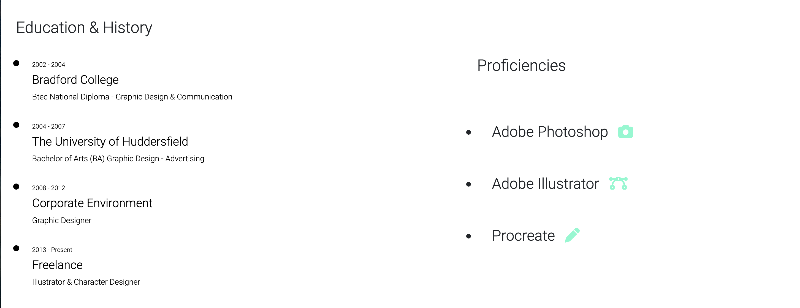
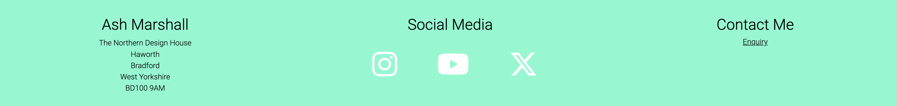

# Ash Marshall Design

Welcome to Ash Marshall Design, this is your invitation to work with someone who lives and breaths character design and has a wonderful, colorful, visually stunning art style. 
Through this website you will be introduced to this artists wonderful creations, get an overview of some of their most eye-catching designs, have the ability to download their entire portfolio and finally contact them directly to discuss commissions, work requests or just say hello!

This site is targeted towards creative professionals looking to collaborate or more generally anyone looking for assistance on a creative project, on which  they may not possess the skills themselves to complete. The site will be useful to showcase the style of art the artist produces and what sort of projects they are used to working with and offering them an opportunity to contact the artist directly to discuss project ideas. 

## Features

### Navigation Bar

- The navigation bar is featured across all pages of the website allowing easy navigation around the site. It is fully responsive icluding links within the logo and Home button for the Homepage, and links to the Gallery page and Contact page.

- The navigation section allows the user to navigate the website completey and easily with links to all sections and works across all devices. It eliminates the need for the user to use the back button on the browser to revisit the previous page. 

### The Landing Page Image

- The landing page has a striking illustration to immediately grab the attention of the user and introduce them to the type of work they can expect from the artist. It features an animation to help bring the characters to life and illustrate to the user the dynamic style the artist uses. 

- There is a text overlay explaining what services are available to the user 'Freelance Illustration & Character Design'.

- There is a call to action to allow users in a hurry to immediately download the artists portfolio so they can look at this when they have more free time. The button is descriptive so the user knows exactly what action will occur if they click it, the portfolio downloads when pressed.

### About Me Section

- There is a photograph of the artist which is half photo half illustration, to show the user who they are potentially working with but also shows they are creative and passionate about art.

- There is a paragraph with a brief overview of the artist, what they like to do and where they are based, to give the user a better understanding of the artist and their background. 

- The section features a colored background to seperate it from the landing page, to highlight it as a section and to make it stand out and catch the attention of the user encouraging them to read it. 

### Education & History *and* Proficiencies

- The Education & History section shows the user where the artist was educated and when, and how long they have been working in this industry. This offers the user confidence in working with the artist due to their experience leading to them wanting to use the artist for their project.

- The proficiencies section shows the user what programs the artist is most comfortable in using. They are programs used in industry so again this shows the user that the artist can handle most tasks required in this industry.

### Client Testimonial

- Here are some positive words from a previous client, the user will be interested to hear that the artist has received positive feedback from a previous client, this again offers the user confidence that the artist will provide a good service.

## The Footer

The footer section consists of 3 sections, artists address, socail media links, and a link to the contact page.

- The address offers the user confidence that they are dealing with a professional, they have a headquarters and can be contacted.

- The social media icons are all links to the corresponding social media sights of the artist (*the twitter one just opens twitter in a new tab for now as the artist does not have a twitter acount, this could be altered later when the account is set up*). They all open in new tabs to allow the user to stay on the website for easier navigation. It offers the user another way to stay connected to the artist and alternative methods of contact as well.

- Contact section offers a link to the contact page so that no matter what page the user is on, once they are ready, there is an easy alternate navigation to contact the artist. It is underlined so the user is aware it is a link and has a hover effect so they know it is clickable. 

## Gallery

The gallery page shows the user a selection of the artists work so they can get a real feel of what they can acheive.

## Validator Testing

### HTML
No errors were returned on any of the pages when passing through the official W3C validator
- W3C Validator for [Home](https://validator.w3.org/nu/?doc=https%3A%2F%2Fuctv9805.github.io%2Fchar-design-portfolio%2Findex.html)
- W3C Validator for [Gallery](https://validator.w3.org/nu/?doc=https%3A%2F%2Fuctv9805.github.io%2Fchar-design-portfolio%2Fgallery.html)
- W3C Validator for [Contact](https://validator.w3.org/nu/?doc=https%3A%2F%2Fuctv9805.github.io%2Fchar-design-portfolio%2Fcontact.html)
- W3C Validator for [Contact Action](https://validator.w3.org/nu/?doc=https%3A%2F%2Fuctv9805.github.io%2Fchar-design-portfolio%2Fcontactaction.html)

### CSS
When testing using the official jigsaw validator using the URI some errors were raised coming directly from the bootstrap URI, not related to any of my code - I proved this by adding my CSS and ran the validator by direct input and no errros were reported in my code

- Jigsaw Validator for [style.css](http://jigsaw.w3.org/css-validator/validator$link)

