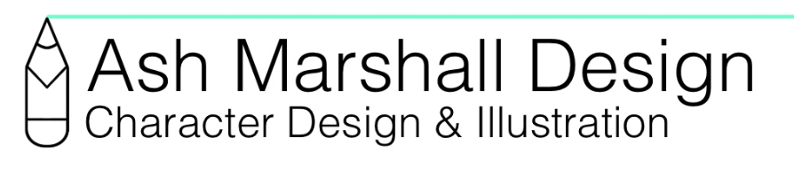
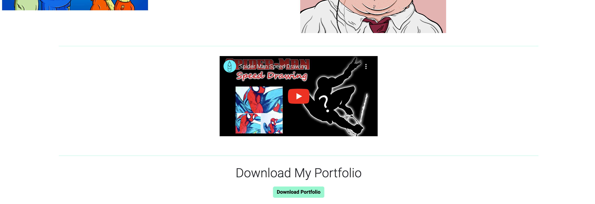
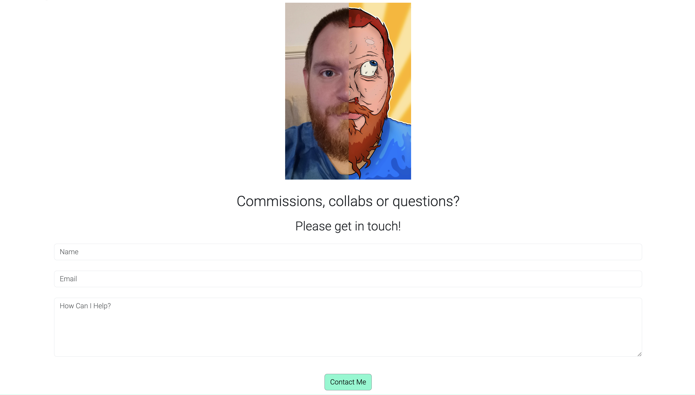
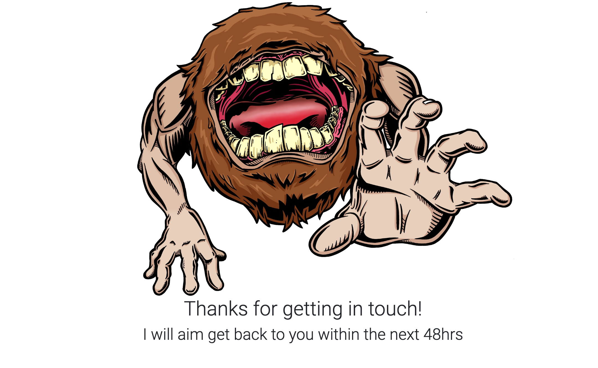

# Ash Marshall Design

Welcome to Ash Marshall Design, this is your invitation to work with someone who lives and breaths character design and has a wonderful, colorful, visually stunning art style. 
Through this website you will be introduced to this artists wonderful creations, get an overview of some of their most eye-catching designs, have the ability to download their entire portfolio and finally contact them directly to discuss commissions, work requests or just say hello!

This site is targeted towards creative professionals looking to collaborate or more generally anyone looking for assistance on a creative project, on which  they may not possess the skills themselves to complete. The site will be useful to the user as it showcases the style of art the artist produces and what sort of projects they are used to working with. It finally offers the user an opportunity to contact the artist directly to discuss project ideas. 

## Planning Stage

### Target Audiences:

- Creative industry professionals looking for a freelance artist to collaborate with.
- Any professional who requires a freelance artist to provide creative work within their own industry.
- General public who are looking to commission a peice of work by a creative professional.
- Followers of the artist who are looking for a piece of work creating for their own collection.

### User Stories:

- As a user, As a user, I want to be able to navigate the page easily and be able to find what I am looking for.
- As a user, I want to be able to see the artists work so I know what I can expect if I choose to collaborate with them.
- As a user, I want to find out more about the artist to see if they are the right candidate for my commission.
- As a user, I want to fill out the contact form in order to contact the artist.

### Site Aims:

- To give the user an introduction to the artist and offers information on who they are and what they have done.
- Showcase some of the artists work to get them interested in what they can provide.
- To get the user to download the artists portfolio.
- Give the user links to the artists social media sites to offer further ways of interacting with the artist. 
- To entice the user to contact the artist to work with them or commission a piece of work.

### How this is acheived:

- The homepage offers an about me section, education & history and proficiencies sections and client testimonials. This introduces the user to the artist and gives them confidence they have good experience in their field.

- The gallery page offers lots of imagery of the artists work and what they are capable of. There are also illustrations throughout the website so the user is always thinking about the art that could be provided. 

- There is an initial option to download the portfolio on the homepage if the user is in a rush and would like to look later - There is also a download option at the bottom of the gallery page so once the user has seen and enjoyed the artists work it is likely they will then download to see more. 

- There are links to social media sites in the footer - this is shown across all pages and the links open in new tabs for easier navigation

- The whole flow of the webpage should lead the user naturally to the contact page, they have been enticed by the imagery and art and would like to work with the artist - there is also a link to the contact page on the footer which runs throughout the site for easy navigation when they are ready to contact. 

## Wireframes

I created wireframes using Balsamiq to properly plan my project and get a good idea of the layout and how to use the available space. Below are the links to the wireframes which includes layouts for desktop, mobile and tablet versions of the site.

- [Desktop Wireframe](assets/docs/wireframes/desktopwireframe.png)

- [Mobile Wireframe](assets/docs/wireframes/mobilewireframe.png)

- [Tablet Wireframe](assets/docs/wireframes/tabletwireframe.png)

Some small changes were made during the build from the original wireframes but overall the final design is close to the original wireframes.

The changes made include:

- Adding a download link for the portfolio on the gallery page.
- A final page was added to provide confirmation of contact received once form filled out.
- I added a section on the homepage for proficiencies to show what programs the artist is confident using.

## Color profile

I wanted to keep the overall look of the website very clean, to make sure the art was the main talking point throughout, the art offered a fantastic color bursts throughout the site so it was important that the backgrounds were white so as not to draw attention away from the illustrations. That being said I needed to use a color that was subtle but offered options to break up sections and I chose the color from the artists logo so that the whole site was inkeeping with this design. The text was a combination of black or white purely for clarity so any body of text was easy to read for the user. 

 

## Features

### Navigation Bar

- The navigation bar is featured across all pages of the website allowing easy navigation around the site. It is fully responsive icluding links within the logo and Home button for the Homepage, and links to the Gallery page and Contact page.

- The navigation section allows the user to navigate the website completey and easily with links to all sections and works across all devices. It eliminates the need for the user to use the back button on the browser to revisit the previous page. 

### The Landing Page Image

- The landing page has a striking illustration to immediately grab the attention of the user and introduce them to the type of work they can expect from the artist. It features an animation to help bring the characters to life and illustrate to the user the dynamic style the artist uses. 

- There is a text overlay explaining what services are available to the user 'Freelance Illustration & Character Design'.

- There is a call to action to allow users in a hurry to immediately download the artists portfolio so they can look at this when they have more free time. The button is descriptive so the user knows exactly what action will occur if they click it, the portfolio downloads when pressed.

### About Me Section

- There is a photograph of the artist which is half photo half illustration, to show the user who they are potentially working with but also shows they are creative and passionate about art.

- There is a paragraph with a brief overview of the artist, what they like to do and where they are based, to give the user a better understanding of the artist and their background. 

- The section features a colored background to seperate it from the landing page, to highlight it as a section and to make it stand out and catch the attention of the user encouraging them to read it. 

### Education & History *and* Proficiencies

- The Education & History section shows the user where the artist was educated and when, and how long they have been working in this industry. This offers the user confidence in working with the artist due to their experience leading to them wanting to use the artist for their project.

- The proficiencies section shows the user what programs the artist is most comfortable in using. They are programs used in industry so again this shows the user that the artist can handle most tasks required in this industry.

### Client Testimonial

- Here are some positive words from a previous client, the user will be interested to hear that the artist has received positive feedback from a previous client, this again offers the user confidence that the artist will provide a good service.

## The Footer

The footer section consists of 3 sections, artists address, socail media links, and a link to the contact page.

- The address offers the user confidence that they are dealing with a professional, they have a headquarters and can be contacted.

- The social media icons are all links to the corresponding social media sights of the artist (*the twitter one just opens twitter in a new tab for now as the artist does not have a twitter acount, this could be altered later when the account is set up*). They all open in new tabs to allow the user to stay on the website for easier navigation. It offers the user another way to stay connected to the artist and alternative methods of contact as well.

- Contact section offers a link to the contact page so that no matter what page the user is on, once they are ready, there is an easy alternate navigation to contact the artist. It is underlined so the user is aware it is a link and has a hover effect so they know it is clickable. 

## Gallery Page

The gallery page shows the user a selection of the artists work so they can get a real feel of what they can acheive. There is also an embedded youtube video of a speed-drawing allowing the artist to showcase their work in a different way. Below this there is an opportunity to download the artists portfolio in full.

- The gallery is set out in a nice tile style view, it is easy to view and makes the gallery tidy. It is valuable to the user as they can identify the type of creative style of work the artist can offer.

- The youtube video is valuable to the user as it shows the artist at work, proving their skills in an entertaining way.

- Adding the portfolio download at the bottom of the gallery means the user has had chance to view the work of the artist, become interested in their work and then as the opportunity arises to download the portfolio the work on show should have generated enough interest that they are willing to hit the download button.

### Contact Page

This allows the user to contact the artist directly. After viewing their work througout the site the user can now get in touch to arrange to work with the artisit.

- The user is asked to provide their name and email address - the form will prompt the user if any of the information is filled out incorrectly or not at all.

- There is a section to provide a description of the work request or commission details so the user can effectively communicate their request.

- The submit button is descriptive and fits the color theme of the website so the user can easily identify where to press to submit their request.

- The image was used to help communicate they are contacting the artist and to help keep the theme of the website centered around the artwork.

### Contact Response

A page was made so that if the user filled out the contact page, they would get a response to show them that the request was filled out successfully and they would be contacted by the artist in due course.

- It offers a confirmation of success and a response time so the user knows when to expect a response.

- There is an illustration inkeeping with the theme of the website.

## Features Left to Implement

### Projects Section
- I think in the future a good section to add would be projects. Rather than a gallery page that showcases all the art it would include more details about a specific project - multiple images and a description of the work and ideas behind the project. 
- It could be an extra page on the site and have information on multiple projects - gives the user and further look into the artists process and further entices them to get in touch.

# Testing

## Validator Testing

### HTML
No errors were returned on any of the pages when passing through the official W3C validator
- W3C Validator for [Home](https://validator.w3.org/nu/?doc=https%3A%2F%2Fuctv9805.github.io%2Fchar-design-portfolio%2Findex.html)
- W3C Validator for [Gallery](https://validator.w3.org/nu/?doc=https%3A%2F%2Fuctv9805.github.io%2Fchar-design-portfolio%2Fgallery.html)
- W3C Validator for [Contact](https://validator.w3.org/nu/?doc=https%3A%2F%2Fuctv9805.github.io%2Fchar-design-portfolio%2Fcontact.html)
- W3C Validator for [Contact Action](https://validator.w3.org/nu/?doc=https%3A%2F%2Fuctv9805.github.io%2Fchar-design-portfolio%2Fcontactaction.html)

### CSS
When testing using the official jigsaw validator using the URI some errors were raised coming directly from the bootstrap URI, not related to any of my code - I proved this by adding my CSS and ran the validator by direct input and no errros were reported in my code

- Jigsaw Validator for [style.css](http://jigsaw.w3.org/css-validator/validator$link)

